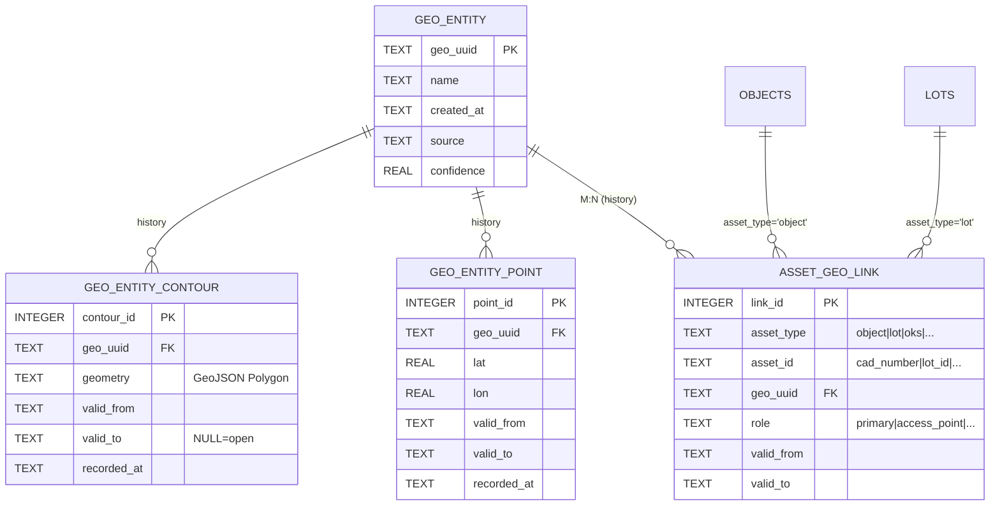

# §7 Geo entities — схема, инварианты, workflow

> Источник правды: `schema/migrations/0003_geo_entities.sql` + §7 в
> `schema/egrn_current_schema.sql`. Контракт C2:
> `contracts/bundle-db-slice/schema.json` (section=7, restorable=false).
> Решение: `obsidian/Decisions/ADR-002-geo-entities.md`.

## Зачем

Геосущность — именованная точка и/или контур, к которой привязываются активы
(объекты, лоты). Она **может меняться во времени** (контур переразмечен,
точка центрирована заново) и **может быть общей для нескольких активов**
(или у одного актива могут быть разные точки для разных ролей: центр,
точка доступа, контур влияния).

До §7 геометрия жила только в KMZ (frontend-офлайн); в БД её не было. С §7 —
есть БД-сторонняя истина, bitemporal-история, и фронт получает её через
тот же `ViewModel.geo` без изменения C4-контракта.

## ER (mermaid)



## Инварианты (CHECK)

| Таблица | Инвариант |
|---|---|
| geo_entity | `confidence ∈ [0..1]` |
| geo_entity_contour | `valid_to IS NULL OR valid_to > valid_from` |
| geo_entity_point | `valid_to IS NULL OR valid_to > valid_from`; `lat ∈ [-90..90]`; `lon ∈ [-180..180]`; confidence как выше |
| asset_geo_link | `valid_to IS NULL OR valid_to > valid_from`; UNIQUE(asset_type, asset_id, geo_uuid, role, valid_from) |

## Bitemporal модель

- `valid_from / valid_to` — **реальное время** («что было в мире»).
  `valid_to=NULL` = «открытая запись, актуальна по сей день».
- `recorded_at` — **время записи в БД** (когда мы узнали; default
  `datetime('now')`). Нужен для «что мы знали в день Y про состояние в день X»
  — пока не используется в запросах, но фиксируется без затрат на будущее
  (roadmap parser-A v2).

### Lookup-семантика

«Какая геометрия сейчас?» = `valid_from ≤ today AND (valid_to IS NULL OR valid_to > today)`.

«Какая геометрия была на X?» = `valid_from ≤ X AND (valid_to IS NULL OR valid_to > X)`.

Helper `backend.app.services.geo.geo_for_asset(conn, asset_type, asset_id, as_of=…)`
делает ровно это, возвращая `GeoSnapshot(geo_uuid, name, point, contour)`.

## Workflow данных

### A. Парсер KMZ → DB
Один Placemark → одна geo_entity:
1. `register_geo(conn, name=placemark.name or cad, source='kmz')` → uuid.
2. Если есть Polygon: `add_contour(conn, uuid, geometry, valid_from=today, source='kmz')`.
3. Если есть Point (или centroid полигона): `add_point(conn, uuid, lat, lon, valid_from=today, source='kmz')`.
4. `link_asset(conn, 'object', cad_number, uuid, valid_from=today, role='primary', source='kmz')`.

Повторный импорт того же KMZ:
- Если контур изменился → новая запись `geo_entity_contour` с свежей
  `valid_from`; старая остаётся (история).
- Если линк уже есть с тем же `valid_from` — UNIQUE-конфликт; impl: либо
  пропуск, либо закрытие старого `valid_to=today` + новый линк (см.
  «Политика закрытия» ниже).

### B. Backend → ViewModel
`build_object_viewmodel` тянет `primary_geo_for_asset(conn, 'object', cad, as_of=as_of)` и
кладёт в `ViewModel.geo = {center: snap.point[::-1] if snap.point else None,
geometry: snap.contour, ...}`. Без §7-записей `geo` остаётся пустым (как было до).

### C. Frontend
Без изменений — ViewModel.geo та же. Карта/граф работают, как сейчас.

## Политика закрытия (как закрывать старую запись)

**Сейчас**: helper НЕ закрывает автоматически. Чтение берёт самую свежую по
`valid_from ≤ as_of`. Это «append-only» подход — никаких `UPDATE`.

**Когда переходить на явное закрытие** (`valid_to=новый valid_from`):
- Когда нужны точные интервалы для аналитики (отчёт «сколько объект имел
  такую-то площадь»).
- Когда подключается parser-A v2 bitemporal (post 020).

До тех пор — не усложнять.

## Не в scope §7

- Геопроекции / трансформации СК (всё в WGS84).
- Spatial-индексы / R-Tree (SQLite без SpatiaLite; пока выборки = единицы
  тысяч, не нужно).
- Площадь / периметр / пересечения — считать на стороне фронта при
  необходимости (turf.js) или backend (shapely) при подключении.

## Применение миграции

```bash
# dev (через init_db_cli) — пересоздаёт БД с §1..§5 + 0001 (§6) + 0003 (§7)
python -m parser.exporters.etp.init_db_cli --db ekcelo.sqlite --force

# или вручную
sqlite3 ekcelo.sqlite < schema/migrations/0003_geo_entities.sql
```

Прод-runtime миграции (через `parser/egrn_parser/db/migrations.py`) — добавить
ветку для §7 при первом проде. Сейчас БД не в проде (CLAUDE.md §1).
